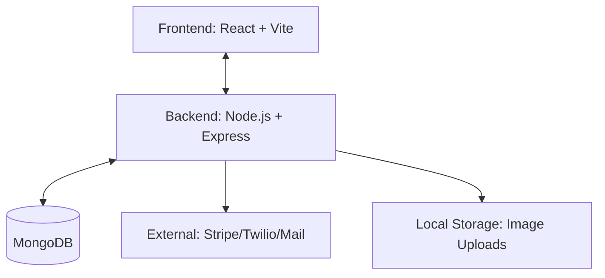

# 🍔 Food App Delivery Solution

A full-stack, secure food delivery application featuring a robust backend, interactive frontend, and containerized deployment.

## 🏗 Architecture & Workflow

The application follows a modern client-server architecture with a clear separation of concerns.



### ⚡ Key Features

- **Authentication**: JWT-based auth with OTP (One Time Password) verification via email.
- **Product Management**: Full CRUD for food items with image upload support using Multer.
- **Cart System**: Real-time cart management linked to user profiles.
- **Orders**: Secure order placement workflow.
- **Security**: Helmet, Rate Limiting, CSRF protection, and Input Sanitization.

---

## 🛠 Tech Stack

### Frontend

- **Framework**: [React 19](https://react.dev/)
- **Bundler**: [Vite](https://vitejs.dev/)
- **Routing**: React Router DOM (v7)
- **Styling**: Vanilla CSS / Modules
- **State/API**: Axios & Hooks

### Backend

- **Runtime**: Node.js
- **Framework**: Express.js
- **ORM**: Mongoose (MongoDB)
- **Security**: Helmet, Express-Rate-Limit, BcryptJS
- **File Handling**: Multer (Local storage)
- **Mailing**: Nodemailer

---

## 🚀 Getting Started

### Prerequisites

- [Node.js](https://nodejs.org/) (v18+)
- [Docker](https://www.docker.com/) & Docker Compose
- [MongoDB](https://www.mongodb.com/) (Local or Atlas)

### Local Setup

1. **Clone the repository**

   ```bash
   git clone <repository-url>
   cd "Food App"
   ```

2. **Backend Configuration**

   - Navigate to `/backend`
   - Create a `.env` file:
     ```env
     PORT=5000
     MONGO_URI=your_mongodb_connection_string
     JWT_SECRET=your_secret_key
     EMAIL_HOST=smtp.mailtrap.io
     EMAIL_PORT=2525
     EMAIL_USER=your_user
     EMAIL_PASS=your_pass
     ```
   - Install dependencies and start:
     ```bash
     npm install
     npm run dev
     ```

3. **Frontend Configuration**
   - Navigate to `/frontend`
   - Install dependencies and start:
     ```bash
     npm install
     npm run dev
     ```

### Docker Deployment

Run the entire stack using Docker Compose:

```bash
docker-compose up --build
```

---

## 🔌 API Documentation

All API routes are prefixed with `/api/v1`.

### 🔐 Authentication (`/auth`)

| Endpoint      | Method | Description                   |
| :------------ | :----- | :---------------------------- |
| `/register`   | `POST` | Create account & send OTP     |
| `/verify-otp` | `POST` | Verify email with OTP         |
| `/login`      | `POST` | Authenticate & get JWT Cookie |
| `/:id`        | `GET`  | Get user profile              |
| `/logout`     | `POST` | Clear session cookie          |

### 🍕 Food Management (`/food`)

| Endpoint | Method   | Description               |
| :------- | :------- | :------------------------ |
| `/ `     | `GET`    | List all food items       |
| `/ `     | `POST`   | Add new food (with image) |
| `/:id`   | `GET`    | Get single food details   |
| `/:id`   | `PUT`    | Update food item          |
| `/:id`   | `DELETE` | Remove food item          |

### 🛒 Cart & Orders (`/cart`, `/order`)

| Endpoint            | Method | Description                   |
| :------------------ | :----- | :---------------------------- |
| `/cart/add`         | `POST` | Add item to user cart         |
| `/cart/remove`      | `POST` | Remove item from cart         |
| `/cart/get/:userId` | `GET`  | Get user's current cart       |
| `/order/place`      | `POST` | Place a new order (Auth req.) |

---

## 📂 Project Structure

```text
📁 Food App
├── 📁 backend          # Express API & Server logic
│   ├── 📁 controllers  # Request handlers
│   ├── 📁 models       # Mongoose schemas
│   ├── 📁 routes       # API endpoint definitions
│   └── 📁 uploads      # Static files (images)
├── 📁 frontend         # React Client application
│   └── 📁 src
│       ├── 📁 components
│       └── 📁 pages
└── 📄 docker-compose.yml
```
